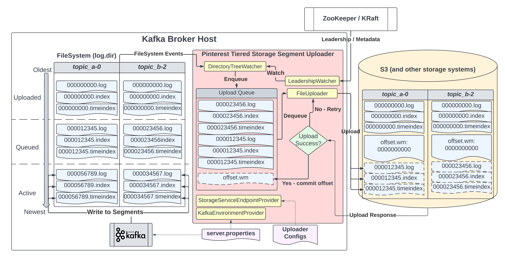

# Tiered Storage Segment Uploader

## Overview
This module contains the uploader code that is used to upload Kafka log segments to the backing tiered storage filesystem.
It is designed to be a long-running, standalone, and independent process that runs on each Kafka broker. 
It uploads finalized log segments to the backing filesystem.
Only S3 is supported as the backing filesystem at the moment.

## Architecture


## Usage
The segment uploader entrypoint class is `KafkaSegmentUploader`. At a minimum, running the segment uploader requires:
1. `-DkafkaEnvironmentProviderClass`: This system property should be provided upon running the segment uploader. It should
provide the FQDN of the class that provides the Kafka environment, which should be an implementation of `KafkaEnvironmentProvider`.
2. Config directory: this should be provided as the first argument to the segment uploader. It should point to a 
directory which contains a `.properties` file that contains the configurations for the segment uploader. The file that
the uploader chooses to use in this directory is determined by the Kafka cluster ID that is provided by `clusterId()` method
for the `KafkaEnvironmentProvider` implementation. Therefore, the properties file should be named as `<clusterId>.properties`.

## Configuration
The segment uploader configurations are passed via the aforementioned properties file. Available configurations
are listed in `SegmentUploaderConfiguration` class.

## Architecture Overview
The segment uploader is designed to be a long-running process that uploads Kafka log segments to the backing tiered storage filesystem.
It is designed to be run as a standalone process on every Kafka broker, and only uploads log segments for a topic partition
if it is the leader for that partition.

The segment uploader relies on Zookeeper to keep track of leadership changes.

The segment uploader places a watch on the Kafka log directory and its subdirectories for filesystem changes.
When a new log segment is created, the uploader will upload the previous log segment that was just closed to the backing filesystem.

Each upload will consist of 3 parts: the segment file, the index file, and the time index file. Once these files are successfully
uploaded, an `offset.wm` file will also be uploaded for that topic partition which contains the offset of the last uploaded log segment.
This is used to resume uploads from the last uploaded offset in case of a failure or restart.


## Build
To build with maven:
```
mvn clean install
```

## Test
To run tests with maven:
```
mvn test
```